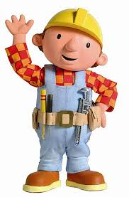

  

# Bob Constructor (website builder)

Seriously this project still WIP whenever is ready to be used I'll finish the readme

Contendra una app open source para construccion de sitios web graficos. Probablemente con Svelte y Backend agnostic

*How it will work ?*

Basically this is a UI to construct website as simple as possible. The UI will bootstrap itself with either an empty json {} schema or from an already created. This UI will dynamically write the schema based on changes let's say that a new page is going to be added

{
...
pages: [{},{},{/*new record*/}]
...
}

*Parser*: We are going to rely on Javascript native JSON parser to generate the objects in memory. 

How customizable ? 

We ought to be able to bind data to the templates. For instance if there is a page we should be able to render a listings information there Like a List

List -> bind to listings
 each item will have access to the attributes of the listing object 
 per each (item) -> 
   Header (value=item.title) 
   Content (value=item.excerpt) 
   Content (value=item.description) 
   List -> bind to amenities
   per each (amenity) -> 
    Content (value=amenity.name)
